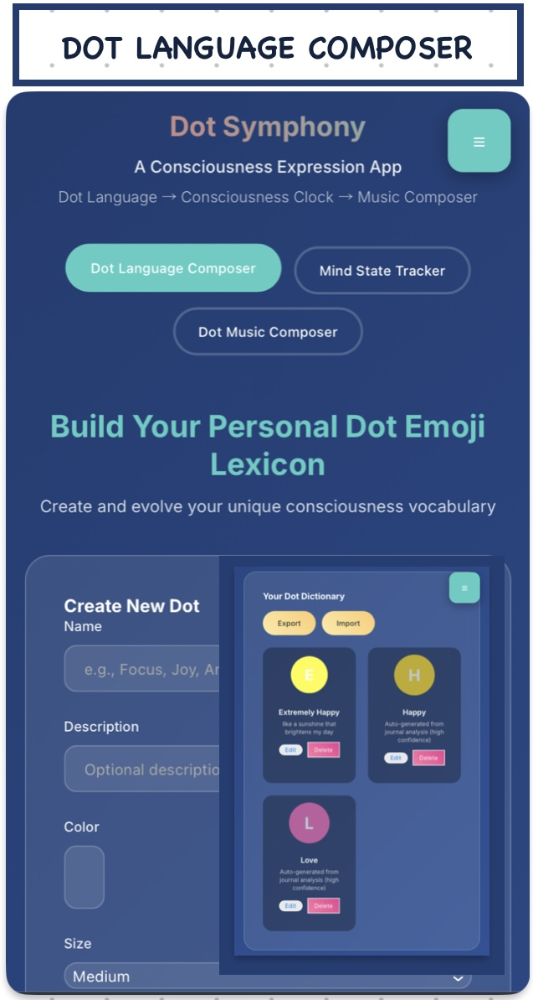
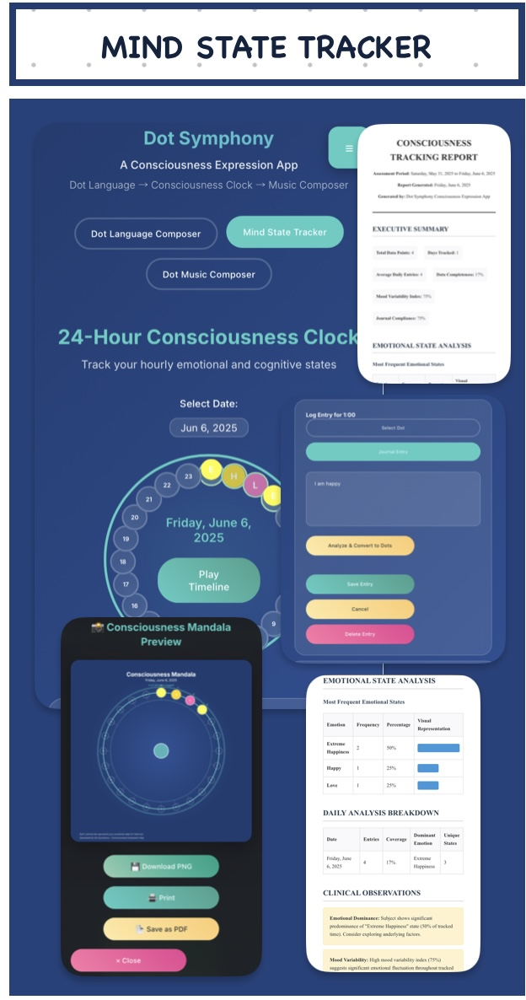
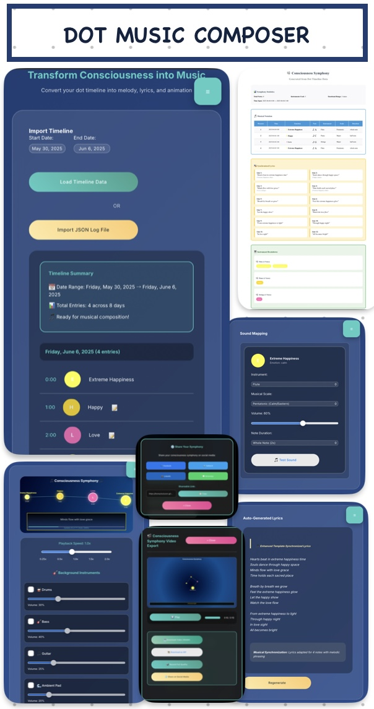

# Dot Symphony - A Consciousness Expression App

Dot Symphony is a revolutionary web application that transforms human consciousness and emotional states into visual art and musical compositions. This comprehensive tool combines emotional tracking, visual representation, and AI-powered music generation to create a unique digital wellness experience.

[**LIVE VIEW**](https://htmlpreview.github.io/?https://github.com/honeylouluzon/Dot-Symphony/blob/main/index.html)

[**GITHUB PAGES**](https://honeylouluzon.github.io/Dot-Symphony/)

## 🌟 Overview

Dot Symphony consists of three integrated modules that work together to create a complete consciousness expression system:

1. **Dot Language Composer** - Create personalized emotional vocabulary
2. **Mind State Tracker** - 24-hour consciousness monitoring system  
3. **Dot Music Composer** - Transform emotions into music and visualizations

## 🎯 Core Features

### Dot Language Composer

- **Custom Dot Creation**: Build personalized emotional vocabulary with custom colors, shapes, and animations
- **Visual Properties**: Choose from circles, squares, triangles, and diamonds
- **Animation Effects**: Pulse, fade, rotate, and bounce animations
- **Export/Import**: Save and share dot dictionaries
- **Real-time Preview**: See dot changes instantly

### Mind State Tracker

- **24-Hour Clock Interface**: Interactive circular timeline for hourly tracking
- **Dual Entry Methods**: Select existing dots or write journal entries
- **AI Analysis**: LLM-powered emotion detection from text
- **Auto-expansion**: Automatically create new dots from journal analysis
- **Visual Timeline**: Animated playback of daily emotional journey
- **Export Options**: PNG mandalas, animated GIFs, JSON data, and comprehensive reports

### Dot Music Composer

- **Timeline Import**: Load data from date ranges or JSON files
- **Sound Mapping**: Map emotions to instruments and musical scales
- **AI-Enhanced Composition**: LLM-powered melody generation using mathematical concepts
- **Synchronized Lyrics**: Auto-generated lyrics aligned with musical notes
- **Background Instruments**: Drums, bass, guitar, and ambient pad with AI patterns
- **Real-time Visualization**: Animated consciousness symphony display
- **Export Formats**: Video (WebM), animated GIFs, MIDI data, and sheet music

## 🧠 AI Integration

### Supported LLM Providers

- **OpenAI**
  - Models: `gpt-3.5-turbo`, `gpt-4`, `gpt-4-turbo`

- **Anthropic (Claude)**
  - Models: `claude-3-haiku-20240307`, `claude-3-sonnet-20240229`, `claude-3-opus-20240229`

- **Google Gemini**
  - Models: `gemini-1.5-flash`, `gemini-1.5-pro`, `gemini-pro`

- **Meta (LLaMA via Hugging Face or Groq)**
  - Models: `llama-2-70b-chat`, `llama-3-70b-instruct`, `llama-3-8b-instruct`

- **DeepSeek**
  - Models: `deepseek-chat`, `deepseek-coder`, `deepseek-v2`

- **Mistral**
  - Models: `mistral-7b-instruct`, `mixtral-8x7b-instruct`, `open-mixtral-8x22b`

- **Perplexity**
  - Models: `pplx-7b-online`, `pplx-7b-chat`, `pplx-70b-online`, `pplx-70b-chat`

- **Cohere**
  - Models: `command-r`, `command-r-plus`

### AI-Powered Features
1. **Emotion Analysis**: Comprehensive emotion detection from journal text
2. **Auto-dot Creation**: Intelligent dot generation with appropriate colors/shapes
3. **Sound Mapping**: Optimal instrument and scale selection for emotions
4. **Lyric Generation**: Poetic consciousness-themed lyrics
5. **Melody Composition**: Mathematical melody generation using cobordism and homotopy
6. **Background Instruments**: Intelligent rhythm and harmony patterns

### Mathematical Framework
The application uses advanced mathematical concepts:
- **Cobordism**: Smooth transitions between emotional states
- **Homotopy**: Continuous deformation while preserving emotional essence
- **Musical Topology**: Notes as points in emotional-frequency space

## 🎨 Technical Architecture

### Frontend Structure
```
index.html          # Main application structure
script.js           # Core application logic and AI integration
style.css           # Responsive design and animations
README.md           # This documentation
termsOfUse.md       # Terms and conditions
privacyPolicy.md    # Privacy policy
```

### Core Classes and Methods

#### DotSymphony Main Class
```javascript
class DotSymphony {
    constructor()                    // Initialize app
    initializeApp()                  // Setup event listeners
    initializeAudioContext()         // Web Audio API setup
    loadStoredData()                 // Restore user data
    saveToStorage()                  // Persist data
}
```

#### Dot Language Composer
```javascript
updateDotPreview()                   // Real-time dot preview
createDotElement(dot, size)          // Render dot visual
saveDot()                           // Save to dictionary
renderDictionary()                  // Display all dots
exportDictionary()                  // Export as JSON
importDictionary()                  // Import from JSON
```

#### Mind State Tracker
```javascript
renderHourRing()                    // 24-hour clock display
openEntryPanel(hour)                // Entry form
analyzeJournalEntry()               // AI emotion analysis
saveTimelineEntry()                 // Save with validation
playTimeline()                      // Animated playback
exportTimelinePNG()                 // Mandala generation
exportTimelineGIF()                 // Animated export
generateMedicalReport()             // Comprehensive analysis
```

#### Music Composer
```javascript
generateMusicMapping()              // AI-enhanced sound mapping
generateLyrics()                    // AI lyric generation
playMusicSymphony()                 // Audio playback
renderMusicVisualization()          // Real-time visuals
exportVideo()                       // Video generation
exportMIDI()                        // MIDI export
generateSheetMusic()                // Musical notation
```

#### AI Integration
```javascript
analyzeLLM(text)                    // Multi-provider analysis
generateLyricsWithLLM(prompt)       // Lyric generation
generateLLMSoundMapping(dot)        // Intelligent mapping
generateLLMEnhancedMelody()         // Mathematical composition
```

### Data Structures

#### Dot Object
```javascript
{
    id: timestamp,
    name: "string",
    description: "string",
    color: "#hexcode",
    size: "small|medium|large",
    shape: "circle|square|triangle|diamond",
    animation: "none|pulse|fade|rotate|bounce",
    created: "ISO datetime"
}
```

#### Timeline Entry
```javascript
{
    dot: DotObject,
    journal: "string",
    timestamp: "ISO datetime"
}
```

#### Music Mapping
```javascript
{
    instrument: "string",
    scale: "major|minor|pentatonic|blues",
    volume: number,
    noteLength: "quarter|half|whole",
    baseFrequency: number,
    llmGenerated: boolean
}
```

## 🎵 Audio System

### Web Audio API Integration
- **Oscillator-based synthesis**: Pure tone generation
- **Multiple waveforms**: Sine, triangle, sawtooth, square
- **Dynamic envelopes**: ADSR-style volume control
- **Filter effects**: Lowpass, highpass filtering
- **Real-time processing**: Instant audio feedback

### Musical Features
- **Multiple scales**: Major, minor, pentatonic, blues
- **Instrument simulation**: Piano, guitar, synth, flute, strings, drums, bass, bells, harp
- **Speed control**: 0.25x to 2.0x playback speed
- **Background instruments**: AI-generated drum, bass, guitar, and ambient patterns
- **Synchronized playback**: Lyrics aligned with musical notes

## 📱 Responsive Design

### Breakpoints
- **Desktop**: > 768px - Full feature layout
- **Tablet**: 481-768px - Optimized grid layout
- **Mobile**: ≤ 480px - Single column, touch-optimized

### Mobile Optimizations
- Touch-friendly controls (minimum 44px targets)
- Responsive grid layouts
- Collapsible menus and panels
- Optimized font sizes (clamp functions)
- Swipe-friendly interfaces

## 🔒 Privacy & Security

### Data Storage
- **Local Storage**: All user data stored locally
- **No Server Communication**: Except for AI API calls
- **Export Control**: User controls all data exports
- **Reset Options**: Complete data clearing available

### AI Privacy
- **API Key Security**: User-provided, not stored on servers
- **Minimal Data**: Only necessary content sent to AI
- **No Permanent Storage**: AI providers don't retain data
- **User Consent**: Clear indication of AI usage

## 🚀 Setup and Installation

### Requirements
- Modern web browser with ES6+ support
- Web Audio API support
- Local storage capability
- Internet connection (for AI features)

### AI Setup
1. Choose your preferred AI provider
2. Create account and obtain API key:
   - **OpenAI**: https://platform.openai.com/api-keys
   - **Anthropic**: https://console.anthropic.com/account/keys
   - **Gemini**: https://makersuite.google.com/app/apikey
   - **Deepseek**: https://platform.deepseek.com/api-keys
   - **Llama**: https://huggingface.co/meta-llama // Usually hosted via Hugging Face
   - **Mistral**: https://console.mistral.ai/api-keys
   - **Perplexity**: https://www.perplexity.ai/settings/api
   - **Cohere**: https://dashboard.cohere.com/api-keys
   - **Groq**: https://console.groq.com/keys
3. Enter API key in Settings
4. Select appropriate model

### Local Development
```bash
# Serve files using any static server
python -m http.server 8000
# or
npx serve .
# or use Replit's built-in server
```

## 🎨 Customization Guide

### Theme System
```css
:root {
    --primary-color: #4ecdc4;    /* Accent color */
    --secondary-color: #ff6b6b;  /* Secondary accents */
    --dark-bg: /* Gradient */;   /* Background */
    --glass-bg: /* Transparency */; /* Glass morphism */
}
```

### Adding New Dot Shapes
1. Extend shape options in HTML select
2. Add CSS styling in `createDotElement()`
3. Update shape rendering logic

### Custom Instruments
1. Add to `waveforms` object in `playDotNote()`
2. Create instrument-specific synthesis
3. Update UI options

### New AI Providers
1. Add provider to settings dropdown
2. Implement API integration in `analyzeLLM()`
3. Add model options in `updateLLMModelOptions()`

## 🧪 Advanced Features

### Mathematical Music Generation
The app uses advanced mathematical concepts for music generation:

```javascript
// Cobordism: Smooth transitions
const transition = (prevNote, nextNote, factor) => {
    return prevNote + (nextNote - prevNote) * factor;
};

// Homotopy: Continuous deformation
const deformation = (baseFreq, emotionalWeight) => {
    return baseFreq * (1 + emotionalWeight * 0.1);
};
```

### Custom Export Formats
Extend export functionality:
1. Add new export button
2. Implement generation function
3. Handle file download/sharing

### Analytics Integration
Add consciousness analytics:
1. Emotion frequency analysis
2. Pattern recognition
3. Trend visualization
4. Predictive modeling

## 🐛 Troubleshooting

### Common Issues

**Audio not playing**
- Check browser audio permissions
- Verify Web Audio API support
- Ensure user interaction before playback

**AI features not working**
- Verify API key is correct
- Check internet connection
- Confirm provider service status

**Export failures**
- Check browser download permissions
- Verify sufficient storage space
- Try different export formats

**Mobile performance**
- Reduce animation complexity
- Limit simultaneous audio streams
- Use smaller canvas sizes

### Performance Optimization
- Implement object pooling for dots
- Use requestAnimationFrame for animations
- Debounce rapid user inputs
- Optimize canvas rendering

## 🔮 Future Enhancements

🎯 Dot Generation Intelligence: The current emotion detection in the app already leverages an LLM to identify the emotional tone of journal entries. However, shape, color, and animation are still generated using static datasets. In the future, the goal is to make **LLM-generated visual dot emojis** fully dynamic, where:

---

### 1. 🔷 Shape Based on Emotional “Badness” Score

The shape of each dot emoji will reflect the perceived negativity or "badness" of an emotion using a **scoring system from 1 to 10**:

- This score can be derived from sentiment analysis or a pre-defined **emotion intensity scale**.
- Example:
  - A neutral or positive emotion (e.g., **"joy"**) might score **1–3**, represented as a **circle** (0 corners).
  - A moderately negative emotion (e.g., **"annoyed"**) might score **5–6**, rendered as a **hexagon**.
  - A highly negative emotion (e.g., **"hate"**) might score **10**, forming a **decagon**.
- This scoring could be based on LLM outputs or combined with datasets like **NRC Emotion Lexicon** or **SentiWordNet**.

---

### 2. 🌈 Color Based on Emotion–Hue Mapping Theory

The emotional color of the dot will no longer be random but based on **psychologically backed color–emotion associations**.

**Referenced studies include:**

- *Plutchik’s Wheel of Emotions* – e.g., **Joy = Yellow**, **Anger = Red**
- *Valdez & Mehrabian (1994)* – emotional effects of hue, brightness, and saturation
- *Kaya & Epps (2004)* – cross-cultural emotion–color responses
- *Sutton & Altarriba (2016)* – color connotation in emotion language

**Implementation plans:**

- **Single emotion** → mapped to a defined hue (e.g., anger → red)
- **Blended emotion** → mix hues (e.g., joy + anger → orange)
- LLM-generated emotional tags will be translated into RGB/HSB values using this theory for richer expression.

---

### 3. 💫 Animation Based on Arousal Level or Heartbeat Analogy

Future improvements aim to simulate the **emotional energy** through movement, inspired by human arousal (e.g., heart rate, energy level).

**Each emotion is scored with an arousal level (1–10)** using:

- LLM-identified emotion → mapped to arousal based on models such as the **Circumplex Model of Affect**
- Example:
  - **Excitement** = high arousal (9–10)
  - **Calm** = low arousal (1–2)

**Movement translation:**

- **Bounce speed** → reflects energy (faster bounce = higher arousal)
- **Glow frequency** → faster pulsing = heightened emotion
- **Shake/jitter** → added to intense emotions like panic or rage

These dynamic visual features aim to create a **more emotionally expressive and immersive experience**.

---

### 4. Planned Features
- **Collaborative Sessions**: Multi-user consciousness tracking
- **Biometric Integration**: Heart rate, EEG data integration
- **Advanced Analytics**: Machine learning insights
- **Social Features**: Share and compare consciousness patterns
- **VR Support**: Immersive consciousness visualization
- **Voice Integration**: Speech-to-emotion analysis
- **Therapy Integration**: Clinical assessment tools

### 5. API Extensions
- **Webhook Support**: Real-time data streaming
- **Plugin System**: Third-party integrations
- **Cloud Sync**: Cross-device synchronization
- **Team Analytics**: Group consciousness insights

## 📞 Support

### Documentation
- **README.md**: This complete guide
- **Terms of Use**: termsOfUse.md
- **Privacy Policy**: privacyPolicy.md

### Community
- Report issues through documentation
- Contribute improvements
- Share consciousness patterns
- Collaborate on features

## 🏷️ License

This application is provided as-is for consciousness exploration and digital wellness purposes. Users retain full ownership of their consciousness data and generated content.

---

**Dot Symphony** - Transforming consciousness into art and music, one dot at a time. 🎵✨
